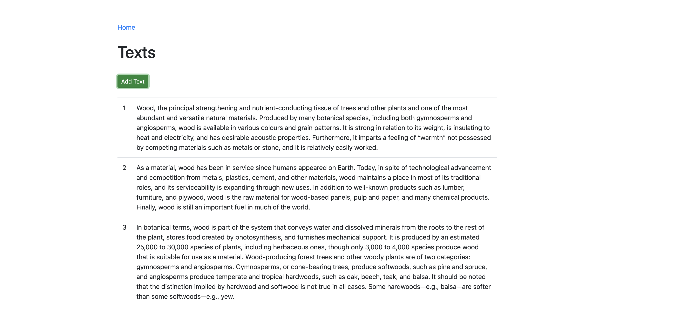
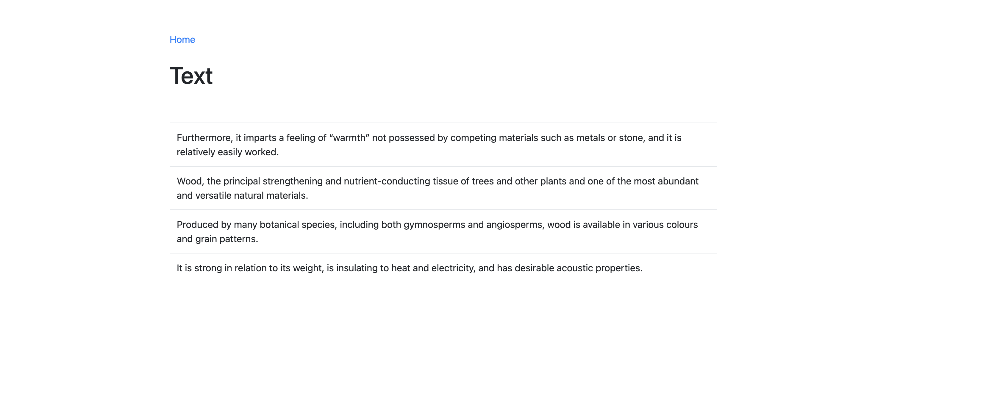
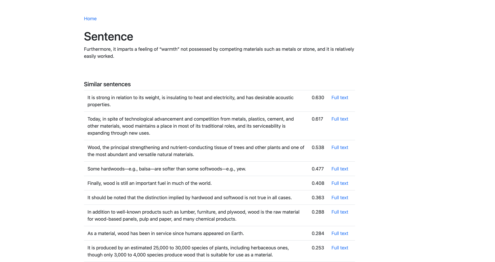

# SmilarText
Single page application (Vue.js, Flask, ElasticSearch) to store texts and find similar sentences among stored texts.

Run:
```bash
docker-compose up
```

Go to:
```bash
http://localhost:8080/
```




